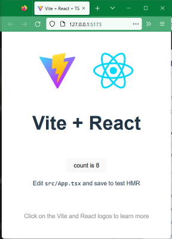

# Getting Started - front-end web technology - 2023-01-30

## Who is Lars Thorup?

- Freelance software engineer: React, TypeScript, Node.js, Python, SQL, AWS
- CTO and co-founder at Triggerz (2015-2020)
- External Lecturer at ITU (2001-2002)
- +25 years of web development experience
- Master in Computer Science, University of Copenhagen (1994)
- [LinkedIn](https://www.linkedin.com/in/larsthorup/)
- Current day job at [Invert Inc](https://invertbio.com/)


## Why is front-end web technology exciting?

- Low barrier to entry
  - In one day you can learn how to build and deploy an app that your parents can then use on their phone
  - Easy to hire people globally to build and deliver new products

## Who are you?

How many of you:

1. have written less than 100 lines of HTML?
1. have written less than 100 lines of CSS?
1. have written less than 100 lines of JavaScript?
1. have your own personal blog or website?
   - which tool do you use?
1. have shown your family software you have made?
1. know that some web apps can be used while offline?
1. have thought about ways to improve the web sites you use?
   - examples?
1. have thought about how blind people use web sites?

## Overview of the entire course

1. [Getting Started](.)
1. [HTML, CSS, JS](../02-html-css-js/)
1. [JavaScript and TypeScript](../03-javascript-typescript/)
1. [React](../04-react/)
1. [Testing](../05-testing/)
1. Forms, routing
1. UX, styling, accessibility
1. REST, HTTP
1. Auth, security
1. State
1. Animation
1. Architecture: SPA, PWA, MPA
1. What's left to learn?

## Inspecting a simple web page

- [Blog of Lars Thorup](https://www.fullstackagile.eu/blog/)
- Network tab (traffic, throttle)
- Console (logs)
- Inspector (HTML, CSS)
- Device simulation
- Lighthouse (assessment, Chrome only)

## Getting started

Goal: get a tiny front-end web application running locally on your machine and deployed to the cloud.

### Node.js

- Install from https://nodejs.org/en/ unless you have it already
- `node --version`
  - Should be at least version 16.

### Git repo

- GitHub / GitLab, create blank repo
- `git clone (repo-url)`
- `cd (directory)`

### Create sample application

- `npm create vite@latest . -- --template react-ts`
- `npm install`

### Run locally

- `npm run dev`



### Extend application to invoke API

In the file `src/App.tsx`, first add this definition of an `AlbumPicker` React component:

```tsx
function AlbumPicker() {
  const [albums, setAlbums] = useState<string[]>([]);
  async function handleSubmit(e: FormEvent) {
    e.preventDefault();
    const target = e.target as typeof e.target & {
      artist: { value: string };
    };
    const artist = encodeURIComponent(target.artist.value);
    const url = `https://musicbrainz.org/ws/2/release?fmt=json&query=artist:${artist}`;
    const response = await fetch(url);
    const mbResult = (await response.json()) as {
      releases: { title: string }[];
    };
    const { releases } = mbResult;
    setAlbums(releases.map(({ title }) => title));
  }
  return (
    <form onSubmit={handleSubmit}>
      <label>
        Artist name:
        <input name="artist" />
      </label>
      <button type="submit">Search</button>
      <p>Albums:</p>
      <ol>
        {albums.map((album) => (
          <li>{album}</li>
        ))}
      </ol>
    </form>
  );
}
```

And then insert an instance of this component into the JSX of the app:

```tsx
<AlbumPicker />
```

### Debugging

Print out information, and view in the "console" tab in the developer tools of the browser (right click + Inspect):

```tsx
console.log(mbResult);
```

Look at the "network" tab in the developer tools.

### Deploy to cloud

Get access on Netlify:

- Sign up for a free plan on [Netlify](https://www.netlify.com/).
  - You might also be able to use [Vercel](https://vercel.com/)
  - or GitHub / GitLab / Cloudflare Pages
- `npm install -g netlify-cli`
- `ntl --version`
  - Should be at least 12.5

Connect project to Netlify

- `ntl init`
  - Decline giving access to GitHub account (ctrl-c)

Deploy latest code:

- `npm run build`
- `ntl deploy`

Share the URL with friends & family :)

## Note on choice of tools

Preference for native platform (as supported by browsers):

- HTML built-in controls (no component libraries)
- CSS
- JavaScript (with types, see below)

Preference for high quality tools (valuable, popular, modern, well maintained)

- TypeScript (for type checking)
- React (reactive over imperative)
- Vite (for bundling)
- Netlify (deployment)
- Vitest (test runner)
- Testing Library (rendering for testing)

Other good tools we could have used, but won't:

- Vue (instead of React)
- Jest (instead of Vitest)
- Vercel (instead of Netlify)
- Redux (state management)

## Exercise

1. Get this up and running on your own machine, including deploying it and viewing your app on another device.
1. Try to get a cursory understanding by reading through the code of App.tsx several times. Help your understanding by sprinkling `console.log` statements here and there. You will learn how all the bits and pieces fit together plus a lot more, during this course.

## Additional exercises

1. Display additional information about each album, such as release date.
1. Add an additional input field to allow the user to filter on album name too.

## Next time

[HTML, CSS, JavaScript](../02-html-css-js/).
