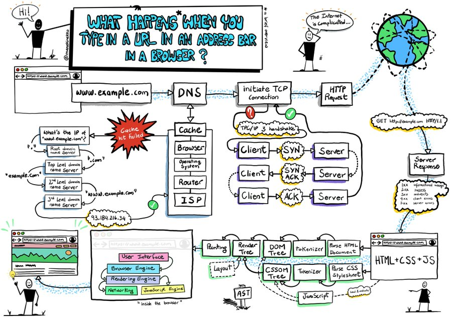

# HTML, CSS, JavaScript - front-end web technology

The core web platform - with no other tools but a browser.

Please read: [Getting started with the web (MDN)](https://developer.mozilla.org/en-US/docs/Learn/Getting_started_with_the_web) by Mozilla.

Note that the focus is on web sites; but we will also discuss how web applications differ from web sites.

## Supplemental reading material

- [Fundamentals of Web apps](https://fullstackopen.com/en/part0/fundamentals_of_web_apps) from University of Helsinki

## Why is HTML, CSS and JavaScript exciting?

- Very mature, no competition, actively being improved
- Accessible: plain text protocols, no compilation needed
- Clear division of responsibility: structure, look, behavior

## Installing basic software

[Install basic software (MDN)](https://developer.mozilla.org/en-US/docs/Learn/Getting_started_with_the_web/Installing_basic_software).

- Firefox, Chrome, Safari, Edge
- Text editor (e.g. Visual Studio Code)

## What will your website look like?

[What will your website look like (MDN)](https://developer.mozilla.org/en-US/docs/Learn/Getting_started_with_the_web/What_will_your_website_look_like).

- Planning: subject area, information structure, look and feel
- Sketching
- Assets: text, colors, images, fonts
- Paths to target files: relative to the source file, `/` as sub-folder seperator

## Dealing with files

[Dealing with files (MDN)](https://developer.mozilla.org/en-US/docs/Learn/Getting_started_with_the_web/Dealing_with_files).

- Root folder (directory)
- Casing and spacing: lower case, hyphens, no spaces
- Files: index.html
- Sub-folders: images, styles, scripts

## HTML basics

[HTML basics (MDN)](https://developer.mozilla.org/en-US/docs/Learn/Getting_started_with_the_web/HTML_basics).

- Elements, tags, content, attributes
- Comments: `<!-- this is a comment -->`
- Nesting elements
- Images
- Headings
- Paragraphs
- Lists
- Links

Walk through HTML of [Lars' blog](https://www.fullstackagile.eu/blog/).

## CSS basics

[CSS basics (MDN)](https://developer.mozilla.org/en-US/docs/Learn/Getting_started_with_the_web/CSS_basics).

- Rule sets (rules): selector, property, value
- Comments: `/* this is a comment */`
- Selectors: multiple, element/tag, id, class, attribute, pseudo-class
- Fonts
- The _box model_
- Body formatting
- Title formatting
- Image centering

Walk through CSS of [Lars' blog](https://www.fullstackagile.eu/blog/).

## JavaScript basics

[JavaScript basics (MDN)](https://developer.mozilla.org/en-US/docs/Learn/Getting_started_with_the_web/JavaScript_basics).

- Scripts
- DOM API: querySelector()
- Variables, constants
- Data types: string, number, boolean, array, object
- Comments: `// This is a comment`
- Operators: `+`, `-`, `*`, `/`, `=`, `===`, `!`, `!==`
- Conditionals: if, switch
- Functions
- Events and event handlers
- LocalStorage API: setItem(), getItem()
- null

Use JavaScript in the console to manipulate [Lars' blog](https://www.fullstackagile.eu/blog/).

## How the web works

[How the web works (MDN)](https://developer.mozilla.org/en-US/docs/Learn/Getting_started_with_the_web/How_the_Web_works).

- request - response
- browser - server
- Protocols: DNS, HTTP, TCP/IP
- Fetching, parsing, executing, painting

(thanks to [@manekinekko](https://twitter.com/manekinekko/status/1281704000572858375?s=20))

## Web applications vs web sites

- No clear distinction
- Web sites are more "document" oriented
- Web applications are more "UI" oriented

## So why do we then want to use all those additional tools?

- [TypeScript](../03-javascript-typescript/) (for type checking)
- [React](../04-react/) (reactive over imperative)
- Vite (for bundling)
- Netlify (deployment)

## Next time

[JavaScript and TypeScript](../03-javascript-typescript/).

## Exercise

- Start creating project groups: 4-6 people per group
- Create your own HTML, CSS and JavaScript files, trying out the various features discussed above.
