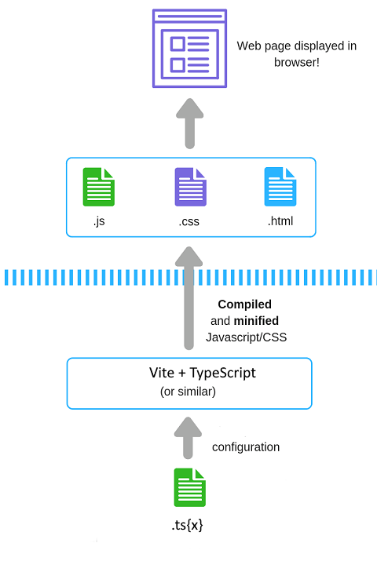

# JavaScript and TypeScript - front-end web technology - 2023-02-06

The programming language of the web - with static typing as an add-on.

Please read:

- [JavaScript Language Overview (MDN)](https://developer.mozilla.org/en-US/docs/Web/JavaScript/Language_Overview) by Mozilla.
- [TypeScript for JavaScript Programmers](https://www.typescriptlang.org/docs/handbook/typescript-in-5-minutes.html) by Microsoft.

## Why is JavaScript exciting?

- Simple language with strong feature set: exceptions, objects and classes, higher order functions, async
- Successfully standardized with multiple implementations (V8 (Chrome, Node.js etc), JavaScriptCore (Safari), SpiderMonkey (Firefox))
- Dynamic typing
- No compilation needed
- V8 created by Danish software developer Lars Bak :)

## Why is TypeScript exciting?

- Extends JavaScript gracefully
  - (Almost) all JavaScript programs are TypeScript programs
  - Multiple syntaxes (TypeScript transpilation, JS Doc type annotations, JavaScript type annotation proposal)
  - Opt-in static typing
- Rich type system
- Created by Danish programming language inventor Anders Hejlsberg :)

## Data Types

In JavaScript the type of values are used and checked at _run-time_.

- Number, String, Boolean, Undefined, Null, Object
- Sub types of Object: Function, Array, Date, RegExp, Error
- Also BigInt, Symbol
- `typeof value`

## Variables

- `let`, `const`, `var`
- block scope
- untyped

## Operators

- `+`, `-`, `*`, `/`, `%`, `**`
- `=`
- `++`, `--`
- `<`, `>`, `<=`, `>=`
- `===`, `!==`
- `&&`, `||`, `!`

## Grammar

- Any unicode characters can be used in identifiers: `const område = 'DTU'`
- Comments: `//`, `/* */`
- Semicolons are (mostly) optional

## Control structure

- `if`, `else`
- `while`, `do...while`, `for`
- `for..of`: iterate over array elements
- `for..in`: iterate over object properties
- `switch`
- `try..catch`, `throw`

## Objects

- dictionary / hash / map
- key value pairs
- nestable
- keys are strings (or symbols)
- `obj.key`, `obj[key]`
- assignment by reference (not cloned)
- `for..in`

## Arrays

- special kind of object
- `[1, 2, 3, 'what?']`
- `a[index]`
- `a.length`
- `for..of`

## Functions

- `function name(param1, param2 = 'default') { ... }`
- anonymous functions
- arrow functions
- recursion
- higher-order functions: functions as parameters and return values
- inner functions

## Classes

- `class`, `constructor`, `this`, `new`
- `static` properties
- `#` for private properties

## Asynchronous code

- single-threaded, no involuntary interruptions
- beware of long-running computations!
- event-loop: queue tasks
- callbacks
- promises
- `async`, `await`

## Modules

- `import`, `export`

## Language and runtime

- `globalThis` (or `Window` in the browser)
- `console`, `Math`, `DOM`, `fetch`

## Naming conventions

## Transpilation and bundling

While we CAN serve individual JavaScript files (with type annotations) directly to the browser, we usually WANT to

- We want to bundle into few larger files to decrease latency
  - (But also chunk into more than one large file to decrease transfer size and time)
- We can now just as well transpile from TypeScript for better code syntax
- We now have to also produce and serve source-maps for better debugging

(diagram via https://jonhilton.net/)

## Next time

.
