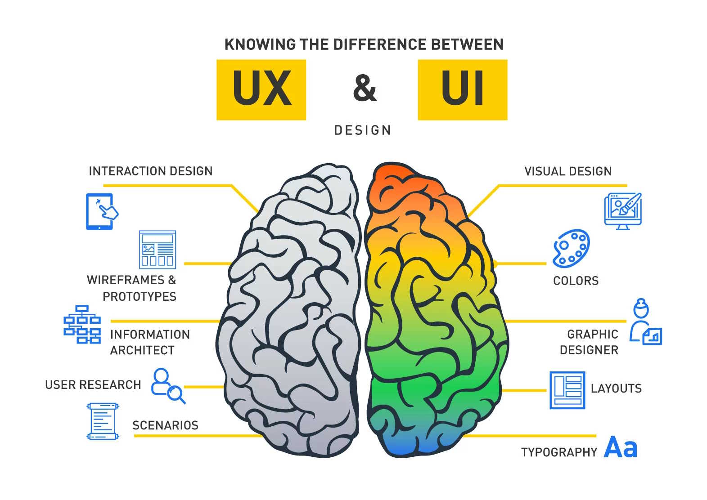

# UX, styling, accessibility - front-end web technology

Make your app a joy to use

Please read:

- [The box model](https://developer.mozilla.org/en-US/docs/Learn/CSS/Building_blocks/The_box_model)
- [Responsive design](https://developer.mozilla.org/en-US/docs/Learn/CSS/CSS_layout/Responsive_Design)
- [Flexbox](https://developer.mozilla.org/en-US/docs/Learn/CSS/CSS_layout/Flexbox)
- [CSS values and units](https://developer.mozilla.org/en-US/docs/Learn/CSS/Building_blocks/Values_and_units)
- [CSS and JavaScript accessibility best practices](https://developer.mozilla.org/en-US/docs/Learn/Accessibility/CSS_and_JavaScript)

## Supplemental reading material

- [UI/UX Cheat Sheet](https://zerotomastery.io/cheatsheets/ui-ux-design-cheat-sheet/)

## Why are UX, styling & accessibility exciting?

- Inclusivity - make your app feel like a welcoming place for all users
- Conversion - minimize agony to maximize conversions of first time users
- An art, not a science - usability testing, monitoring



## UX

Answering the question: What experience do we want our users to have?

- Sketching (paper, whiteboard)
- Inspiration (similar apps)
- User flows / user journeys, personas
- Wireframes (Miro, Whimsical, Figma, Draw.io)
- Prototyping (Figma / HTML / JSX)
- Feedback (team, user testing)

## UI

Which techniques can we use to implement experiences?

- Layout, mobile-first
- Words
- Color
- Typography
- Motion, animation
- Accessibility
- Familiarity

## Layout

- Position, order, hierarchy
- Size, space
- [Responsive design](https://developer.mozilla.org/en-US/docs/Learn/CSS/CSS_layout/Responsive_Design)
- [Flexbox](https://developer.mozilla.org/en-US/docs/Learn/CSS/CSS_layout/Flexbox)
- Media queries
- Table / Grid
- [The box model](https://developer.mozilla.org/en-US/docs/Learn/CSS/Building_blocks/The_box_model)
- Inspiration: https://dribbble.com/

## Colors

- color roles: primary, secondary, background, surface, error
- color palette / color scheme
- light/dark-mode: `@media (prefers-color-scheme: dark)`
- Inspiration: https://coolors.co/

## Accessibility

- Semantic HTML tags
- ``
- Respect styling of tags to correspond with semantics
- Links for navigation, buttons for actions
- Only use tables for tabular data display
- Accessibility Inspector in Firefox Developer Tools

## Sample bugs

- [Wrong focus / auto focus](./login-focus.png)
- [Reflows / fixes size / responsive](./reflow/)
- [Allow bad input / lack of input validation](./bad-input.png)
- [Contradicting language / terminology](./terminology.png)

## Sample layouts

- [Thorup General Store](https://github.com/larsthorup/css-layout-demo)

## Debugging layouts

```css
* {
  outline: 1px solid red;
}
```

## Next time

[HTTP](../08-http/).
