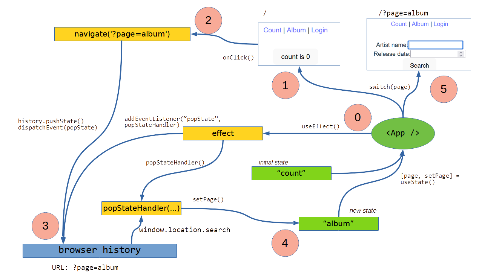

# Routing, animation - front-end web technology

Navigate between pages - smoothly!

Please read:

- [History API](https://developer.mozilla.org/en-US/docs/Web/API/History)
- [popstate event](https://developer.mozilla.org/en-US/docs/Web/API/Window/popstate_event)
- [React Router Tutorial](https://reactrouter.com/en/main/start/tutorial)
  - Up to and including [Client Side Routing](https://reactrouter.com/en/main/start/tutorial#client-side-routing) 
- [Using CSS transforms](https://developer.mozilla.org/en-US/docs/Web/CSS/CSS_Transforms/Using_CSS_transforms)
- [Using CSS transitions](https://developer.mozilla.org/en-US/docs/Web/CSS/CSS_Transitions/Using_CSS_transitions)

## Supplemental reading material

- [How to Create Your Own React Router](https://dev.to/franciscomendes10866/create-your-own-react-router-53ng)

## Why is routing exciting?

- Split information between pages to navigate between
- Back navigation - go back to where I came from
- Sharable deep links

## Why is animation exciting?

- Motion can show what
  - happens (e.g. click indication)
  - happened (e.g. routing)
  - will happen (e.g. call to action)
- Motion can draw attention
- CSS transitions are much more efficient than animating with JavaScript

## Server- or client-side routing?

Server-side routing:

- Multiple HTML files, also called an MPA
- Path-based routing: `/basket`, `/delivery`
- Benefit: sharable links
- Drawback: navigation loads a new HTML file, resetting all state

Client-side routing:

- Single HTML file, also called a Single Page App (SPA)
- Query-based routing: `/?page=basket`, `/?page=delivery`
- Benefit: sharable links, no page load on navigation

## Path-based client-side routing with Netlify

Path-based routing is possible with client-side routing, but require URL rewrite rules to be configured server side for sharable links to work. This is recommended, but outside the scope of this course, as every server framework handles this differently. For Netlify, this can be done with a `_redirects` file that tells the server to always returns `/index.html` no matter the requested URL. By putting this file in the `/public` folder we can ensure that it will be copied to `dist` during `npm run build`, and thus deployed during `netlify deploy`. 

```
/* /index.html 200
```

See also https://docs.netlify.com/routing/redirects/.

## Client-side routing with Web APIs (without a library)

Routing:

- `window.location.search` - get the current route
- `URLSearchParams` - parse query part of URL
- listen for `popstate` event with `addEventListener`
- useEffect to synchronize URL with App state
- conditional render based on App state

Navigation:

- `history.pushState` - to ensure that back will work
- `popstate`, `dispatchEvent` - trigger the listener to synchronize with app state

Diagram:

0. Add `popStateHandler` as "popstate" event listener
1. Render page with default state
2. User clicks on link to another page
3. Click handler pushes new URL and dispatch popstate event
4. `popStateHandler` reads URL and changes state
5. State change triggers re-render



## Client-side routing with React Router

The native `history` Web API is quite low-level, and tricky to use on its own. To make it a little easier we can use one the many libraries, such as [React Router](./https://reactrouter.com/). 

### Routing with React Router

First you will have to install React Router for web:

```bash
npm install react-router-dom
```

Because the routing will be used both by the main application and the tests, it is useful to define the routes in it own file, mapping a URL path to a React component to render, `routes.ts`:

```ts
import { RouteObject } from "react-router-dom";

export const routes: RouteObject[] = [
  {
    path: "/",
    element: <App />,
  },
  {
    path: "/albums",
    element: <AlbumPicker />,
  },
];
```

Then at the very top of the React component tree, in `main.tsx`, you will render a `<RouterProvider>` which has been configured with your routes, instead of the fixed `<App />`:

```tsx
import { RouterProvider } from 'react-router-dom'
import { routes } from './routes'
import { createBrowserRouter } from "react-router-dom";

const router = createBrowserRouter(routes);
ReactDOM.createRoot(document.getElementById('root')!).render(
  <React.StrictMode>
    <RouterProvider router={router} />
  </React.StrictMode>,
)
```

You can now switch between the two pages, by manually modifying the URL.

### Navigation with React Router

To make it easy for users, we usually want explicit menus or buttons for navigation. React Router comes with a <Link /> component for this purpose, which triggers the appropriate `history` events. A Navigation Bar component could look like this:

```tsx
import { Link } from "react-router-dom";

export default function NavigationBar() {
  return (
    <nav>
      <ul>
        <li>
          <Link to="/">Home</Link>
        </li>
        <li>
          <Link to="/albums">Albums</Link>
        </li>
      </ul>
    </nav>
  );
}
```

Remember to include it on your pages!

Users can now easily navigate, and also use the "back"-button of the browser to go back to where they were.

### Testing with React Router

To test our pages and the navigation between them, the tests *also* have to render a `<RouterProvider>`. By using `createMemoryRouter` we can specify the initial route for the test:

```tsx
import { routes } from "./routes";
import { RouterProvider, createMemoryRouter } from "react-router-dom";

describe(App.name, () => {
  it("should render", () => {
    const router = createMemoryRouter(routes, { initialEntries: ["/"] });
    render(<RouterProvider router={router} />);
    expect(screen.getByText("count is 0")).toBeInTheDocument();
  });
});
```

## CSS Transitions

- animatable properties: opacity, size, color, position, rotation, many more
- may use `transform` for relative changes: scale, translate, rotate
- `transition`: property, duration, timing-function, delay
- transitions acts on property changes on that element caused
- change properties with pseudo selector (e.g. `:hover`) or class names
- explore timing functions: - https://easings.net/

Sample call-to-action button transition:

```css
.call-to-action button {
  transition: transform 0.2s ease-in;
}

.call-to-action button:hover {
  transform: scale(1.1);
}
```

Sample navigation transition:

```css
.page {
  transition: opacity 0.4s ease-in;
}

.page.navigating {
  opacity: 0;
}

.page.navigated {
  opacity: 1;
}
```

To trigger the animation you can add your own `navigating` class to your page when initially mounted, and then replace it with `navigated` after it has rendered. `useEffect` can be used to synchronize this "mounting" state of the page:

```tsx
  const [navigating, setNavigating] = useState(true);
  useEffect(() => {
    setNavigating(false);
  }, []);
  ...
  return (
    <div className={`page ${navigating ? "navigating" : "navigated"}`}>
      ...
    </div>
  );
```

## Next time

[State](../10-state/).
