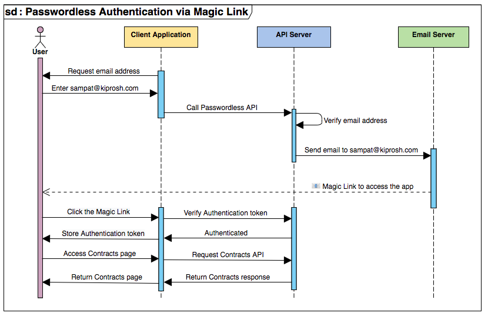

# Security - front-end web technology

Make it safe to use your app!

Please read:

- [OWASP Top 10 Vulnerabilities](https://snyk.io/learn/owasp-top-10-vulnerabilities/) from Snyk

Supplemental reading:

- [OWASP Top 10](https://owasp.org/Top10/) from Open Web Application Security Project

## Why is security exciting?

- Prevent bad actors from harassing users or the company
- Avoid bad publicity
- How much security is enough?

## Access control - OWASP 01

- Prevent unauthorized access to information
- Must be done server side
- Has to be done client side when using Local Storage or similar
- UX: Restrict UI based on user privilege to prevent access control errors

## Encryption - OWASP 02

- Prevent eaves-dropping on data in transit or in rest
- Use SSL: HTTPS & WSS to encrypt data in transit

## Avoid injection - OWASP 03

- Prevent arbitrary code execution on app data
- Encode user data to avoid code injection
- URL encoding with `URLSearchParams`
- HTML is sanitized by React for text elements
- Avoid putting user data into HTML attributes - or encode it
- Content Security Policy - control script loading / injecting

## Secure design - OWASP 04

- Try to avoid unknown unknowns
- Perform threat modeling for all features

## Secure configuration - OWASP 05

- Avoid mis-configuration or unsafe default configurations
- DNS, avoid domain take over
- CORS, configured server-side
- Token expiry, configured server-side

## Updated components - OWASP 06

- Avoid using 3rd party components with (not yet) known vulnerabilities
- npm audit
- npm outdated

## Authentication - OWASP 07

- Prevent identity theft or public access to information
- Multi-factor authentication
- Login with identity provider (Google, Microsoft, Apple, Facebook)
- Passwordless, one-time password, magic link via email or SMS
- Keep expiry on tokens short

## Software and data integrity - OWASP 08

- Prevent decryption of encrypted information
- Keep secrets out of front-end assets
- Keep secrets out of version control (Git)
- Warn users about saving data on shared browser
- HTTPOnly cookie

## Monitoring and logging - OWASP 09

- Detect attacks
- Session logging
- Activity logging
- Access logging
- Front-end or back-end
- Also CI pipelines

## Prevent Server-Side Request Forgery - OWASP 10

- Prevent sending data to unauthorized domains
- Sanitize and validate URLs from user input

## Authentication as a service

- Outsource storing user credentials
- Third-party identity provider services: Auth0, AWS Cognito, Descope, many more
- Use a JWT session token with expiry
- Put token in `Authorization` HTTP header, as a bearer token
- Verify signature of token server-side
- This now proves that request was made from recently authenticated user
- Use https://jwt.io/ to decode tokens

## Implementing password-less authentication with Descope magic links

- Signup and create a project on https://www.descope.com/
- `npm install @descope/web-js-sdk`
- Login.tsx (https://github.com/larsthorup/web-demo-2024)
  - Ask Descope to send email with link
  - Link to our app with token in URL
  - Ask Descope to verify token and return a session token JWT plus user info
- Include session token in back-end requests in Authorization header
- Back-end verifies the signature of the session token JWT
- Back-end extracts user info from JWT
- Use refresh tokens to shorten expiry

(diagram from [@sampatbadhe](https://twitter.com/sampatbadhe/status/1410120075646885892))

## Testing authentication

- Use end-to-end testing, like Playwright or Cypress
- Create a dedicated test user
- Use a mock email service with an API, like https://mailosaur.com/

## Next time

Recap!
