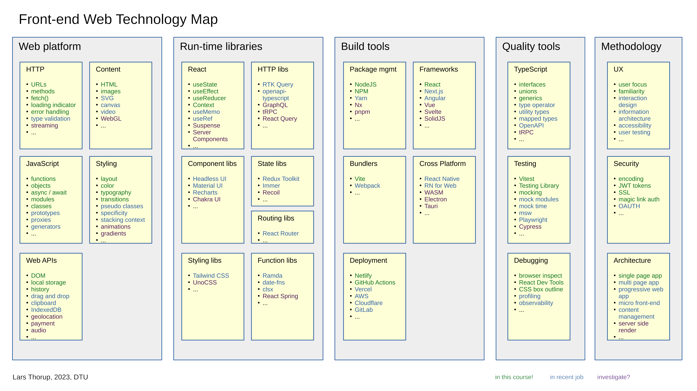

# Technology Map - front-end web technology

What else to learn in addition to what we have already covered in [this course](../README.md)?

(Note: this list is biased by my personal experience and interests, there are many more interesting technologies out there!)

## How to choose technology for your next project?

- It is widely used
- It is of high quality
- It handles most of our needs
- We need substantial parts of it
- It is consistent with our other technologies
- https://www.fullstackagile.eu/2020/01/20/build-or-buy/
